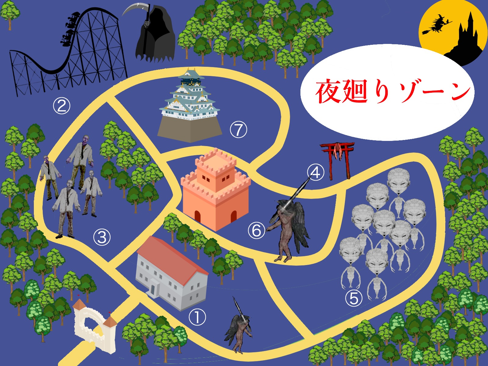

<html>
  
  <link rel="stylesheet" type="text/css" href="floor.css">
  
  <body>
  
  

  
    
園内マップ

  
  
   

    
   

 
 
  

  
  
  
 
  
　 このホームページは、ソフトウェア工学の授業の一環で作成されたものでありフィクションです。
  
  

   
  </body>
  
</html>
